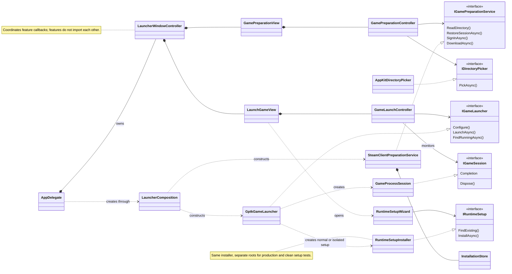

# DeadLocky

Deadlock launcher for Apple Silicon Macs, using .NET 10 and native AppKit on macOS 14 or later.
Release builds use NativeAOT; Debug builds keep the managed runtime for Rider debugging.

## Set up and play

The setup wizard appears when no valid game environment exists. Download Apple's GPTK evaluation
environment from [Apple](https://developer.apple.com/games/game-porting-toolkit/) and select its DMG
or mounted volume. Apple's download and license acceptance remain user actions. The wizard imports
Apple graphics, downloads verified Wine components, prepares a dedicated prefix and installs Windows
Steam. If Rosetta is missing, the wizard offers installation with explicit license acceptance.

Sign in once in Windows Steam and enable Remember me. That same client handles download, updates
and play. The launcher reads saved login metadata locally; it does not store a second Steam token. **Manage Steam**
opens the client. Steam handles game updates when opened through **Manage Steam**
or **Play**. **Download** is shown only until the game is installed. **Change folder…** selects the installation
location; Command-O is its keyboard shortcut.
The default game location is `~/Games/Deadlock`.

**Play** tracks the actual game process. **Close Steam after Deadlock exits** is a saved preference;
when enabled, cleanup targets only the configured dedicated Wine prefix. Other Wine prefixes and
native Steam are not stopped. Keep DeadLocky open for monitoring and cleanup. Closing the launcher
detaches monitoring and leaves the game running. Wine's blocking crash dialog is disabled in the
configured prefix; this does not fix underlying game crashes.

## Architecture and checks

The UML class diagram below uses [Mermaid](https://mermaid.js.org/), an open source diagram renderer.
It is embedded directly in this README; no PlantUML tooling is required.



One application assembly uses PascalCase FSD directories:

- `App`: entry point, lifecycle, menu and composition.
- `Pages/Launcher`: screen layout and coordination between features.
- `Features/PrepareGame`: directory, saved Steam sign-in and installation workflow.
- `Features/LaunchGame`: environment setup, launch, process monitoring and exit cleanup.
- `Entities`: game directory and Steam account values.
- `Shared`: reusable AppKit styles and directory-picker adapter.

Features do not import sibling features. The single application project targets `net10.0-macos` for AppKit
and `net10.0` for portable APIs and models. The xUnit project references its portable target directly. JSON persistence uses source-generated serialization for NativeAOT.
There are no QRCoder or SteamKit2 dependencies, separate QR login, or custom Steam content downloader.
Installation receipts from earlier versions remain readable as a local fallback.

```sh
python3 scripts/check-fsd.py
.dotnet/dotnet test tests/DeadLocky.UnitTests/DeadLocky.UnitTests.csproj
.dotnet/dotnet format DeadLocky.slnx --verify-no-changes
```

[Architecture](docs/fsd-architecture.md),
[development route](docs/learning-route.md).
Build and unit checks do not establish game compatibility. A complete match, input, audio, graphics and
anti-cheat need validation against the actual macOS, Wine, GPTK and Deadlock versions. Successful play
has been reported on the development machine; fresh-install Steam sign-in and full-match coverage need
an end-to-end user check.

## Runtime ownership and sources

State lives under `~/Library/Application Support/DeadLocky`. Normal setup creates
`Runtime/ManagedWine11-r21/engine` and `Prefixes/Steam-Managed`. Existing configured environments remain
supported. Installations use a cross-process lock, staging, ownership markers and a readiness marker;
cancellation removes only new owned destinations. Verified downloads can be reused after interruption.
Images mounted by the wizard are detached; user-mounted volumes remain mounted.

Wine 11 r21 comes from [Highball](https://github.com/gauthierpiarrette/highball-engine).
Standalone Unix dependencies come
from [Gcenx](https://github.com/Gcenx/game-porting-toolkit/releases/tag/Game-Porting-Toolkit-3.0-3);
its Wine 7 DLLs are not copied over Wine 11. Steam comes from [Valve](https://store.steampowered.com/about/).
Apple graphics are supplied by the user under Apple's terms. Redistributing runtime components requires
review of their licenses; the launcher does not redistribute Apple's download.
